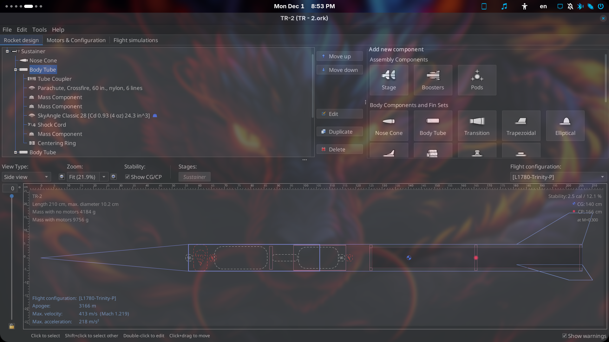
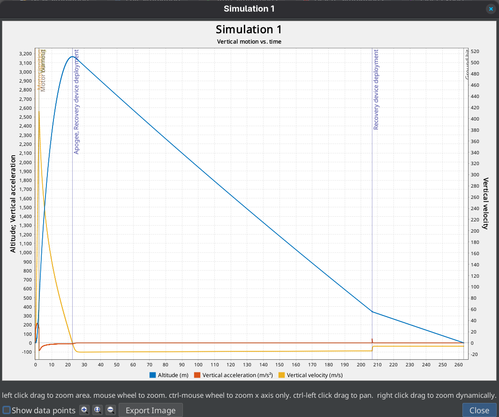
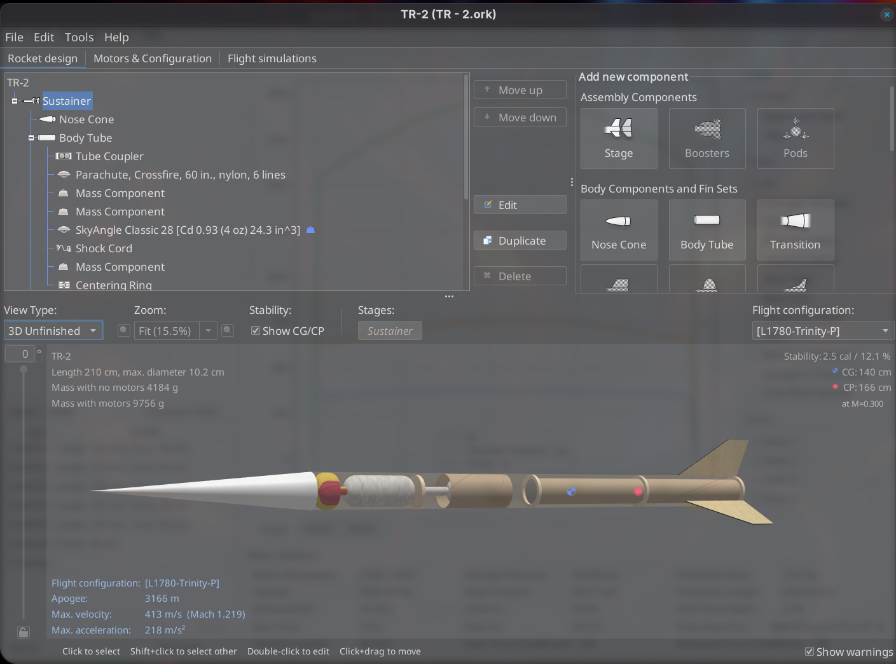
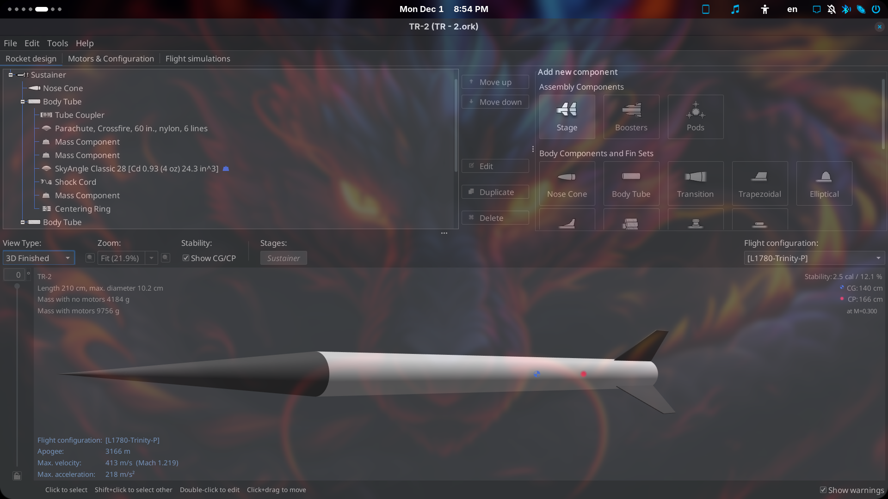
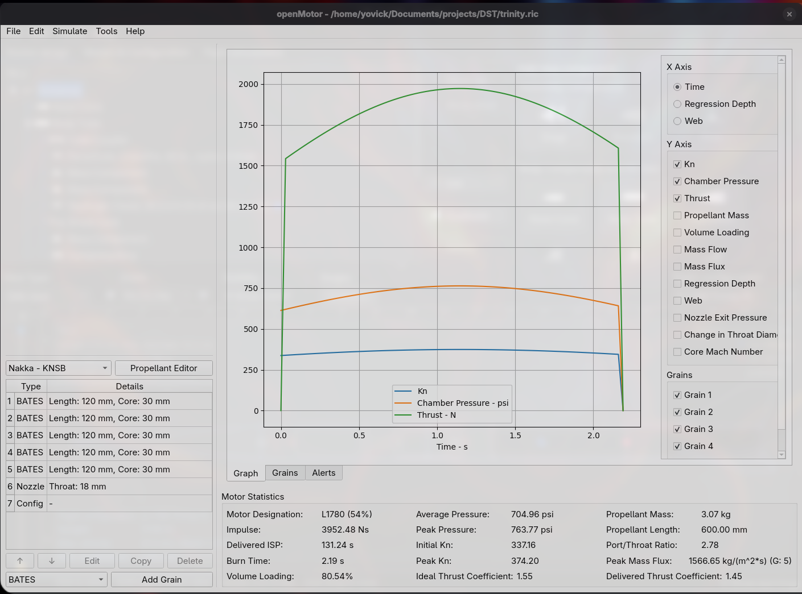

# TR2-Vanguard

Technical Design Report (Phase A) and engineering assets for the TR-2 "Vanguard" SRLV mission. Features Industrial Reliability Doctrine, Rust-based safety-critical avionics, TubeSat payload integration, and Non-Euclidean recovery systems.

## Mission Specifications

## Project Structure

The repository is organized as follows:

- **docs/**: Contains the Technical Design Report.
  - `TR-2-Vanguard.tex`: Main LaTeX source file.
  - `TR-2-Vanguard.pdf`: Compiled report.
  - `img/`: Images and figures used in the report.

- **simulations/**: Engineering simulations and data.
  - `openrocket/`: Flight simulations using OpenRocket (`.ork` files).
  - `motors/`: Solid rocket motor characterization and design files (`.eng`, `.ric`) for OpenMotor.

## Gallery

### Vehicle Views

  
   

### Propulsion

## Tools Required

- **LaTeX**: For compiling the documentation.
- **OpenRocket**: For flight path and stability analysis.
- **OpenMotor**: For internal ballistics simulation.
